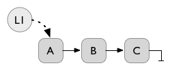
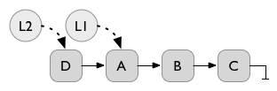
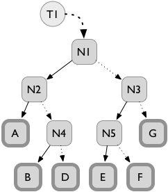
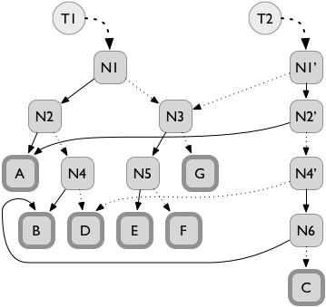
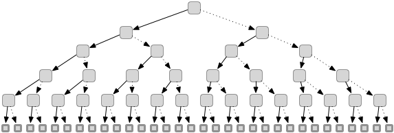
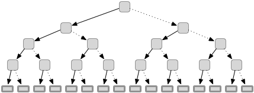
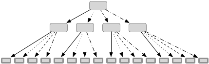
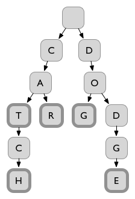
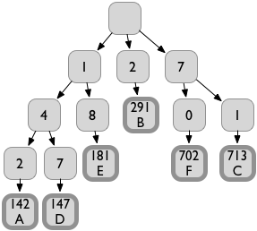

# Persistent Data Structures

## Abstract

Persistent data structures are a special variant of things like lists,
sets, maps and priority queues.  Every time a program modifies a
persistent structure (for example, inserting "42" after the 4th element
in a list), it gets back both a new version that reflects the update and
the pre-update version.

The na&iuml;ve way to implement persistent structures is to make a full
copy for every update.  This would be insanely inefficient in terms of
both time and memory.  The first surprising thing about persistent
structures is that they can be quite competitive with their conventional
cousins in terms of memory and time efficiency.

In this talk I'll cover some classic examples of persistent structures,
explain why they have been growing in popularity recently and discuss
work that remains to be done.

## Outline:
1. What? (part 1)
2. How? (part 1)
   - Singly-linked lists
3. Why?
   - Undo
   - Parallel software
   - Interactive software
4. The bad news: high overhead
5. How? (part 2)
   - Diffing
   - Tree path copying
6. Chunking
7. High-degree trees
8. Hash-mapped array tries
9. Transience
10. Remaining challenges
   - Efficient implementations
   - Verification

## What? (part 1)

- Data structures: lists, arrays, sets, key/value maps, priority queues.
- Most implementations of these structures across the programming
universe are _ephemeral_.  This means that a consequence of performing
an update (like inserting a value into a set) is that the pre-update
version of the structure no longer exists.

Persistent data structure def'n:

> A data structure is _persistent_ if updates create new versions
> without changing previous versions.

    S1 = { "A", "B", "C" }
    S2 = insert( S1, "D" )
    print S1    # prints A, B, C
    print S2    # prints A, B, C, D

If this seems strange, consider if we replaced sets in this example with
numbers:

    N1 = 42
    N2 = N1 + 17
    print N1    # prints 42
    print N2    # prints 59

In many popular languages there is a small set of primitive data types
(numbers, Booleans, strings in some cases) and everything else is
handled through references by default.  One nice slogan for persistent
data structures is _all data are values_.

## How? (part 1)

The na&iuml;ve implementation of persistent data structures is to copy
the entire structure for every update.  This is unacceptably memory
inefficient for the vast majority of applications.

We can do much better!  Hopefully this seems a little magical.  Here's a
quick preview of how this is possible.

This example leaves out lots of important details, but the crucial
intuition is that after an update operation, most of the old version and
the new version are the same.  The engineering of persistent data
structures is all about taking advantage of this fact in clever ways.

## Why?

1. Undo

  Many applications have some concept of a document that the user
  modifies with a sequence of actions.  (e.g. spreadsheets, text,
  drawings.)  _Undo_ is an important feature in such applications.  The
  most conventional implementation of undo is to record the sequence of
  user actions and then applying their inverses in reverse order when
  the user requests an undo.

  The biggest problem with this is that the programmers have to
  implement an inverse for each action.  Some of these might be quite
  tricky and/or require recording auxiliary information.

  Using persistent data structures we can just remember every version of
  the document.  When the user invokes the undo command, we simply
  revert to an older version of the document.  No inverting at all!

  Neat recent concrete example: An upcoming release of Firefox has
  retroactive private mode browsing.  In private (or incognito) mode,
  the browser doesn't accumulate any browsing history.  New Firefox
  feature lets you say: "even though I wasn't browsing in private mode,
  pretend that I was for the last N minutes".

  I don't know how Mozilla implemented this feature, but I would
  definitely use persistent data structures for it.

2. Parallel software

  The ubiquity of parallel processors (i.e. multicores) has dramatically
  increased mainstream interest in parallel programming.  Unfortunately
  making parallel software that works properly is an extremely hard
  problem.  One of the central pitfalls in parallel programming is
  concurrent access to data structures.  Persistent data structures help
  alleviate this problem in a way that I'll discuss later.

3. Interactive software

  Similar to parallelism.  Think of a background spellchecker and a user
  typing.

## The Bad News

Even though persistent structures can be implemented without gratuitous
copying, they're still generally less efficient than their ephemeral
cousins.

1. In some cases the best known persistent structures have a log(N)
slowdown factor.
2. Even when the asymptotics are comparable, many textbook persistent
structures have very bad constant-factor inefficiencies.

These kinds of efficiency differences have been bad enough to keep
persistent structures on the margins of mainstream software development.

## How? part 2

Two major techniques:

1. Diffing
2. Balanced trees and path copying

### Diffing

Like version control (git, subversion).

### Balanced trees and path copying

Let's say we want to insert "C" into the sequence.

The headline result: We only need to copy log(N) nodes to implement all
interesting operations on persistent balanced trees.

Constant memory overhead is still bad.  Simple example: array of bytes
versus a binary tree.

1. Assume each byte is stored in a leaf node.
2. The number of internal nodes in a binary tree is equal to the number
of leaves minus 1.
3. Each internal node needs at least two pointers to its children.  On a
64-bit computer this means each internal node will be at least 16 bytes.
4. Implementing a sequence of bytes as a simple binary tree has
17&times; memory overhead.
5. Also accessing a particular byte requires dereferencing log(N)
pointers.

## Memory Efficiency: Chunking

Instead of storing a single value in each leaf, store a short array of
values (a _chunk_).

Short arrays

N + 16 N / C

1.5&times; memory overhead.

Depth of the tree is still log(N / C) = log(N) - log(C)

## Time Efficiency: High branching factor

Instead of using a binary tree we can build a tree where each internal
node has many children.  This is called a B-tree.  Historically B-trees
have been associated with on-disk databases ("external" storage).
Recently they have gained some popularity for in-memory data structures.

logB(N) = log2(N)/log2(B)

| N   | log2(N) | log32(N) |
|-----|--------------------|---------------------|
| 32  | 5                  | 1                   |
| 1k  | 10                 | 2                   |
| 32k | 15                 | 3                   |
| 1M  | 20                 | 4                   |
| 32M | 25                 | 5                   |
| 1B  | 30                 | 6                   |

## Hash-Mapped Array Tries

Hash-based data structures are extremely widely used because they have
excellent performance characteristics for many applications.
Conventional hash-based structures are based on ephemeral arrays and
until fairly recently no one knew if it was possible to make efficient
persistent hash-based structures.

Enter hash-mapped array tries!

### First let's talk about tries

The name comes from "re<strong>trie</strong>val", but most people
pronounce it "try" to avoid confusion with "tree".

Tries are special kinds of trees that efficiently store collections of
data that have common prefixes.  Here is a trie that represents the set
{"CAT", "CAR", "CATCH", "DOG", "DODGE"}.

Tries were discovered in the process of making a Scrabble-playing
program back in the 1970s.

### Next let's talk about hashes

A hash function takes some (usually large-ish) object and computes a
number (usually in a small-ish range).  Because the size of the domain
is generally much larger than the range, inevitably there will be
multiple objects that hash to the same value.  The special thing about
hash functions is that two objects that are "close" in the domain space
should hash to values that are "far" from each other.

The usual pattern is that we want to store a set of objects, but
comparing the objects to each other is relatively expensive.  So we
compute hash values for each object and use those as the keys.

| Name  | Email | Color      | Flavor  | Fav Number |
|:------|:------|:-----------|:--------|:-----------|
| Alice | a@b.c | sarcoline  | sweet   | 42         |
| Bob   | d@e.f | coquelicot | salty   | 17         |
| Carol | g@h.i | smaragdine | sour    | 1.0        |
| Dave  | j@k.l | mikado     | bitter  | -3         |
| Eve   | m@n.o | glaucous   | umami   | &pi;       |
| Frank | p@q.r | wenge      | piquant | e          |

#### Step 1: Calculate a hashcode for each row:

| Row | Hashcode |
|-----|----------|
| A   | 142      |
| B   | 291      |
| C   | 713      |
| D   | 147      |
| E   | 181      |
| F   | 702      |

#### Step 2: Make a trie using the digits of the hashcode

## Copying big nodes is no fun

Chunking and high-degree trees are generally a good idea, but there is
tension with path copying.  Recall that each update to a tree-based
persistent structure requires copying a (very) small number of paths
from a leaf up to the root.  An array of 32 64-bit pointers is 256Bytes.
In other words, 1/4 of a kB.  That's a non-trivial amount of data to be
copying frequently.

"Transient" data structures to the rescue!  In many applications it's
not necessary to save a version of the structure after every little
update.  Updates naturally cluster together into "transactions".  So the
idea is to update the structure in-place (i.e. treat it like an
ephemeral structure) most of the time, and only do persistent updates
when the application wants to save a particular version for later use.

## What Left To Do?

Data structures is an area of computer science that has received a lot
of research attention, so what's left?

### Still fancy variants to work out.

### Proofs of efficiency.

### Formally verified implementations.
